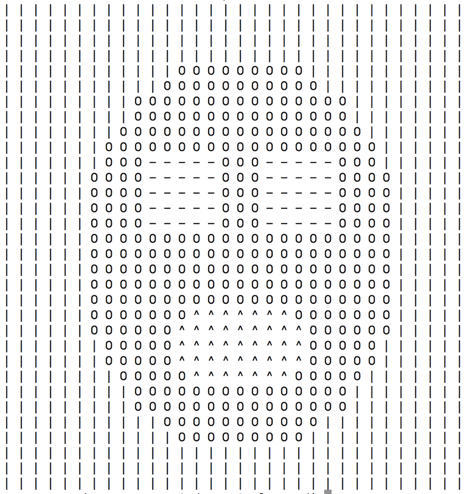

Goals
=====

Learning objectives. At the end of this lab, students should be able to:

- Add functionality to exisiting code base that draws 2D shapes (lecture project)
- Introduce Exceptions to an exisitng code base to demonstrate handling odd behavior with grace
- Add to an exisiting class (representing an image) to make it templated (able to produce either .ppm, .pgm, .pbm or .txt, including template specialization

Orientation
============

As C++ is (mostly) a strongly typed language, however there are often computations we would like to apply to various types, templates give us the ability to apply general compute to a variey of types.  

In particular, we started this quarter with a lecture project that wrote out asci files to represent shapes (remember way back then).

At this point, we are creating drawings with color data:

However, we certainly can represent the same 'image' data as either a character (asci), black and white (boolean), greyscale (integer) or color (r, g, b).  Our first goal for this lab is to use templates to support these varous output types for our drawing program.

The next big idea we are playing with is that many times when our program is running things can go wrong.  We can use assert and debugging and hope our user (and other software engineers) will be well behaved, however, we can also plan to have our programs fail gracefully if all else fails.  We will do this using exceptions.  Exception design is an art that we will only just start to experiment with.  The second half of this lab involves adding exception handling for when we issues in the drawing program.

Orientation
============

